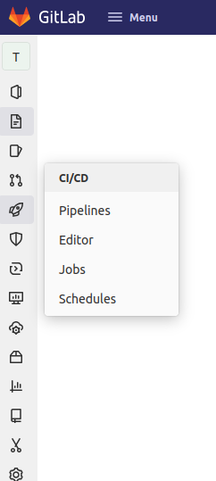
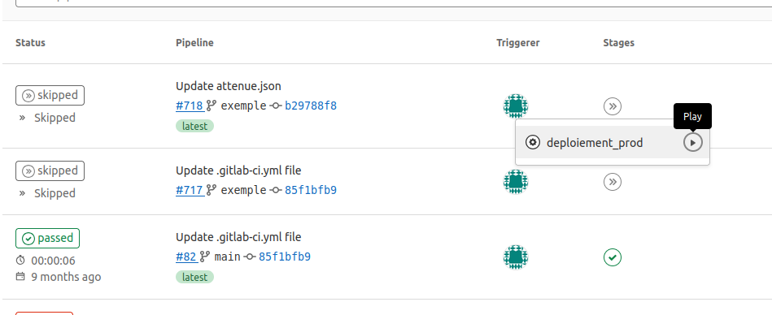

# Accéder à l'interface d'intégration continue

- Ouvrir le projet

- Dans la barre de gauche, cliquer sur l'icône CI/CD :material-rocket-launch-outline:

- Explorer l'interface qui liste les lancements de jobs

## Pour lancer un job manuel

- Cliquer sur l'étape manuel en statut "skipped" :material-chevron-double-right:

- Cliquer sur le bouton play :material-play-circle-outline:

