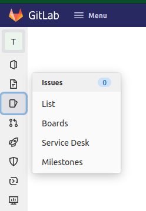
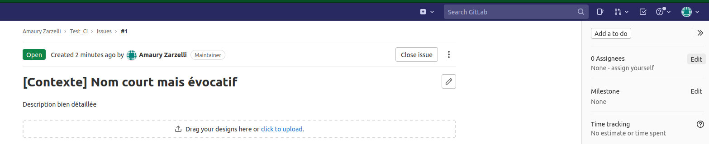

# Création de ticket

- Ouvrir le projet
- Dans la barre du haut, cliquer sur le :material-plus-box:
- Cliquer sur "New issue"

- Dans le menu qui s'ouvre, renseigner le titre du ticket avec un nom court mais évocatif.
- Renseigner le type de ticket : "Issue" pour une demande d'évolution, "Incident" pour rapporter un bug.
- Renseigner la description bien détaillée du ticket.

# Consultation des tickets

- Ouvrir le projet
- Dans la barre latérale gauche, cliquer sur l'item :material-cards-outline: "Issues"

- Pour consulter un ticket en particulier, cliquer sur son titre dans la liste.

# Assignation du ticket

## Changer l'assignation d'un ticket

- Consulter le ticket dont l'assignation est à modifier [voir plus haut](#consultation-des-tickets)
- Dans la barre à droite de l'ecran, à la section "Assignees", cliquer sur "Edit"

- Ajouter l'utilisateur à qui le ticket doit être assigner, supprimer les autres

## Cycle d'assignation du ticket :

- L'utilisateurice crée le ticket et l'assigne au/à la PO
- Le ou la PO assigne le ticket au/à la chef·fe d'équipe MOE
- Le ou la chef·fe d'équipe MOE assigne le ticket au membre d'équipe ciblé pour le développement
- Une fois le dévelopement fait et la MR faite, le membre d'équipe assigne le ticket au/à la chef·fe d'équipe.
- Une fois la MR mergée, le ou la chef·fe d'équipe assigne au/à la PO pour vérification du traitement du ticket.
- Le ou la PO assigne éventuellement au client qui a créé le ticket pour qu'il ou elle fasse la vérification.
