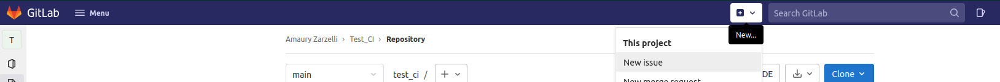
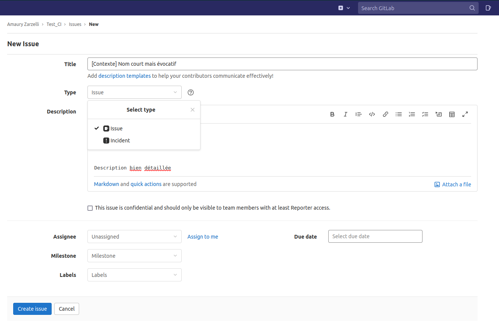

# Création de ticket

- Ouvrir le projet
- Dans la barre du haut, cliquer sur le +
- Cliquer sur "New issue"

- Dans le menu qui s'ouvre, renseigner le titre du ticket avec un nom court mais évocatif.
- Renseigner le type de ticket : "Issue" pour une demande d'évolution, "Incident" pour rapporter un bug.
- Renseigner la description bien détaillée du ticket.

## Assignation du ticket

Voici le cycle d'assignation du ticket :

- L'utilisateur crée le ticket et l'assigne au PO
- Le PO assigne le ticket au chef d'équipe MOE
- Le chef d'équipe MOE assigne le ticket au memebre d'équipe ciblé pour le développement
- Une fois le dévelopement fait et la MR faite, le membre d'équipe essigne le ticket au chef d'équipe.
- Une fois la MR mergée, le chef d'équipe assigne au PO pour vérification du traitement du ticket.
- Le PO assigne éventuellement au client qui a créé le ticket pour qu'il fasse lui-même la vérification.