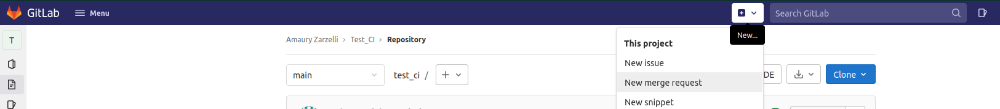
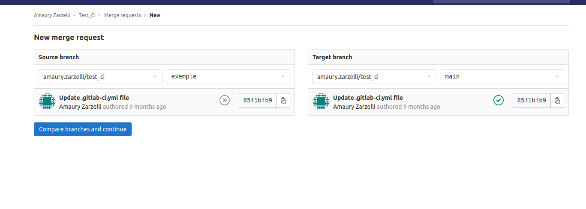
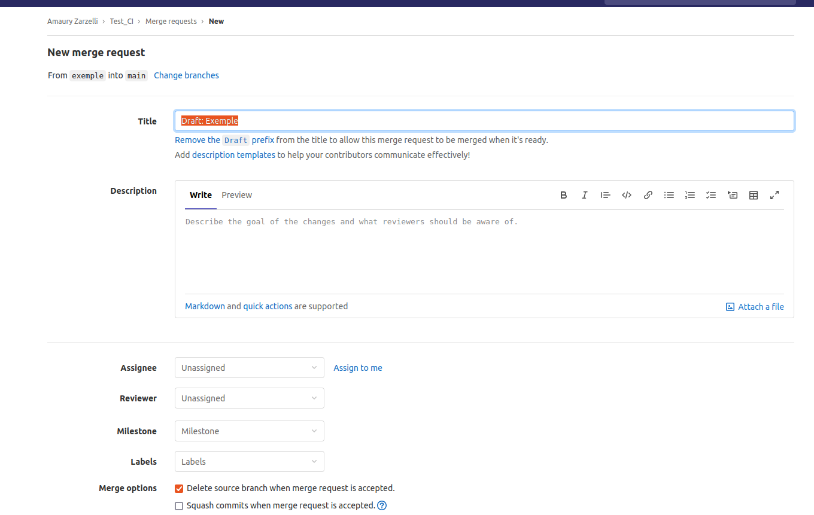
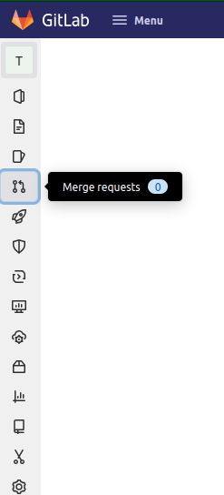
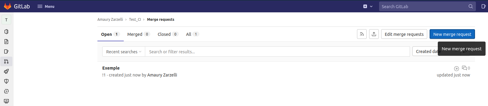

# Merge Requests

## Créer une merge request

- Ouvrir le projet
- Dans la barre du haut, cliquer sur le :material-plus-box:
- Cliquer sur "New merge request"

- Parémétrer les branches : à gauche, la branche à merger (par exemple `feature/...`), à droite la branche sur laquelle merger (`main`).

- Cliquer sur Compare branches and continue
- Dans le menu, renseigner le titre des changements, et une description détaillée de ce qu'apporte la MR. Cocher "Delete source branch" et "Squash commits"

- Valider

## Accepter une merge request

- Ouvrir le projet
- Dans la barre de gauche, cliquer sur :material-source-pull: Merge requests

- Dans la liste des MR, sélectionner celle qu'on va accepter

- Pour valider la MR sans la fusionner, cliquer sur approve.
- Pour fusionner la MR, cliquer sur "Merge". Cocher "Delete source branch" et "Squash commits"
