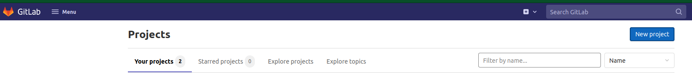
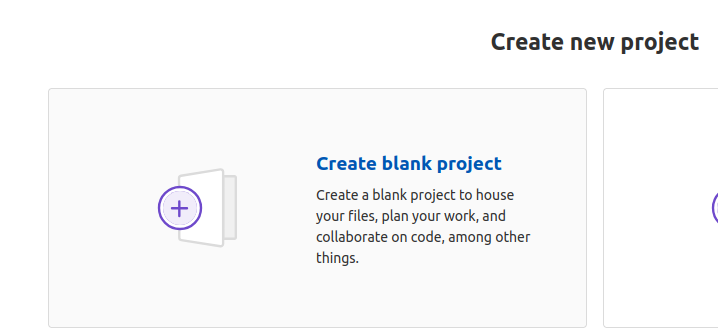
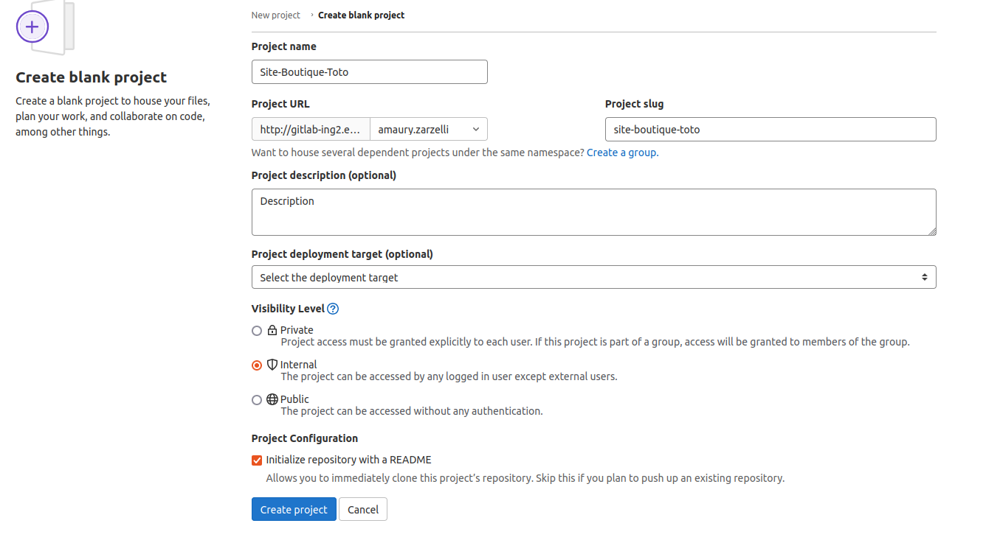
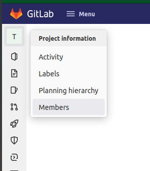
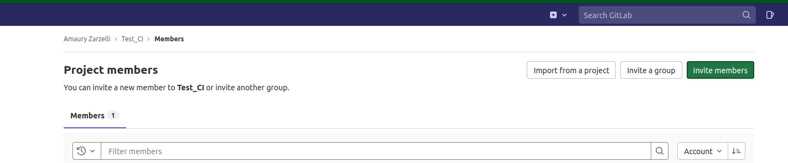
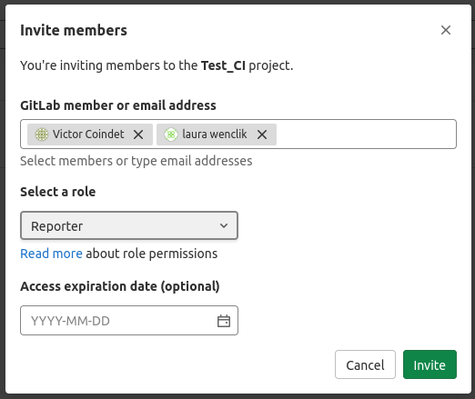

# Créer un projet

## Création du projet

- Ouvir la page d'accueil de Gitlab [http://gitlab-ing2.ensg.eu/](http://gitlab-ing2.ensg.eu/)
- Cliquer sur "New Project"

- Cliquer sur "Create blank project"

- Remplir les champs en fonction de votre projet (nom du site web). Cocher la visibilité "Internal" et l'initalisation du repo avec un README.

- Cliquer sur "Create Project"

## Ajout de membres

- Ouvrir le projet
- Dans la barre de gauche, survoler le premier item (livre ouvert) et cliquer sur "Members"

- Dans le menu qui s'ouvre, cliquer sur "Invite members" en haut à droite

- Dans le menu qui s'ouvre inviter les membres. Saisir le pseudo Gitlab (normalement prenom.nom). Vous pouvez inviter plusieurs personnes à la fois pour le même rôle. Rôle Gitlab en fonction du rôle dans le projet :
    * Utilisateur : Guest
    * Product Owner : Reporter
    * Développeur : Developer
    * Chef d'équipe : normalement c'est vous, et vous êtes déjà Owner

