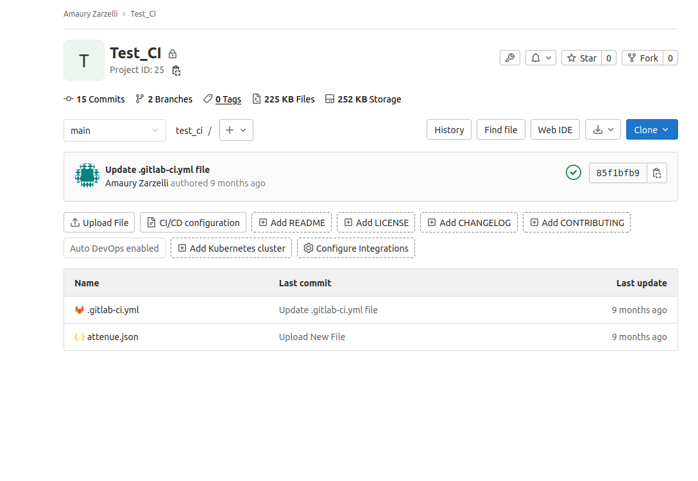
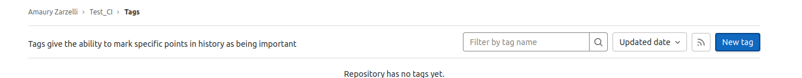
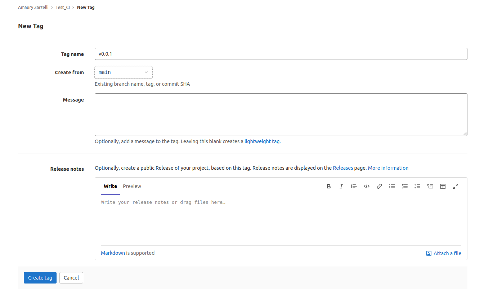

# Création de tag

- Ouvrir le projet
- Dans la vue globale, cliquer sur "X tags" (au début, "0 tags"), en dessous du nom du projet

- Dans le menu qui s'ouvre, cliquer sur "New tag" en haut à droite

- Dans le menu qui s'ouvre, renseigner le nom du tag (au format `v0.0.0`), à partir de la branche `main`. Renseigner les notes de version avec ce qu'apporte le tag par rapport au précédent. Cliquer sur "Create tag"

