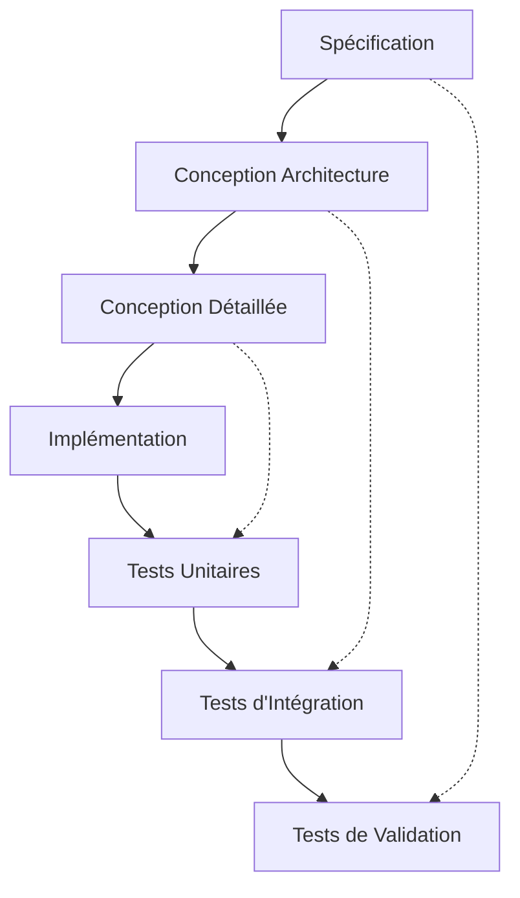
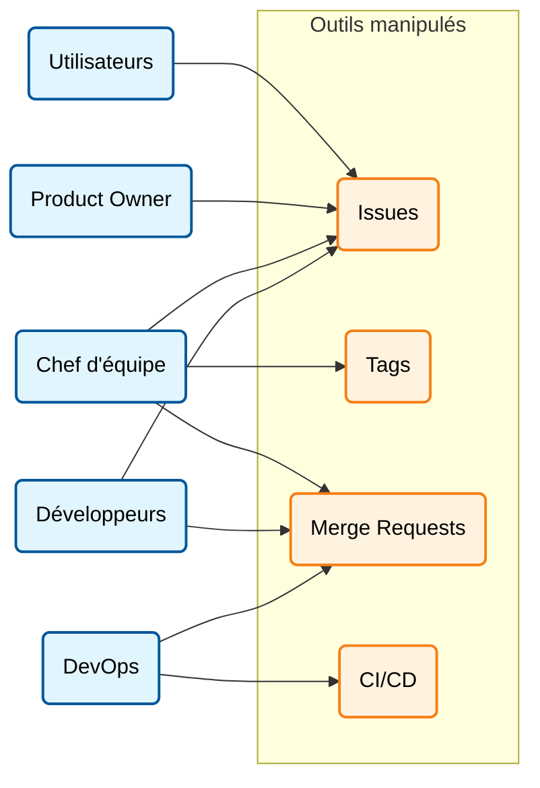

# Gestion de Projet Informatique

```slides
title: Présentation jour 1
url_stub: j1-slides-url
nav:
        - j1-slides/1.md
        - j1-slides/2.md
        - j1-slides/3.md
        - j1-slides/4.md
        - j1-slides/5.md
        - j1-slides/5a.md
        - j1-slides/5bis.md
        - j1-slides/pause.md
        - j1-slides/6.md
        - j1-slides/7.md
        - j1-slides/8.md
        - j1-slides/8a.md
        - j1-slides/8bis.md
        - j1-slides/8c.md
        - j1-slides/9.md
        - j1-slides/10.md
        - j1-slides/10bis.md
        - j1-slides/pause.md
        - j1-slides/11.md
        - j1-slides/11bis.md
        - j1-slides/12.md
        - j1-slides/13.md
        - j1-slides/14.md
        - j1-slides/15.md
```

## 1. À l'origine d'un projet

La genèse d'un projet informatique repose sur la convergence de plusieurs éléments fondamentaux:

* **Des besoins** : L'identification d'un manque ou d'une nécessité.
* **Une décision** : L'acte de lancer le projet.
* **De l'argent** : Le financement nécessaire à la réalisation.
* **Des utilisateurs** : Ceux qui exploiteront le résultat final.
* **Des commanditaires** : Ceux qui portent la demande.

## 2. Les acteurs du projet

### L'équipe de réalisation

Pour réaliser un projet, plusieurs compétences techniques sont mobilisées :

* **Des développeurs**.
* **Des concepteurs**.
* **Des designers**.
* **Des architectes** et **administrateurs réseau**.
* **Des chefs d'équipe**.

### Les rôles clés (MOA vs MOE)

Il est crucial de distinguer les responsabilités de chacun dans la structure du projet:

| Rôle | Description |
| --- | --- |
| **Maîtrise d'Ouvrage (MOA)** | Elle définit le projet et le résultat à obtenir. Elle contrôle la réalisation et valide le résultat final. |
| **Maîtrise d'Œuvre (MOE)** | Elle réalise le projet en respectant les exigences de la MOA (Qualité – Coût - Délai). Elle inclut les développeurs, analystes, architectes, etc. |
| **Utilisateurs** | Ceux pour qui est fait l'ouvrage (le logiciel). |
| **Commanditaire** | Celui qui paie l'ouvrage et choisit la maîtrise d'œuvre. |

---

## 3. Méthodes Traditionnelles

### La méthode en Cascade

C'est une approche linéaire où chaque étape dépend de la précédente:

1. Analyse des besoins.
2. Spécification.
3. Conception architecture.
4. Conception détaillée.
5. Implémentation.
6. Validation.

### Le Cycle en V

Une évolution de la cascade qui met en relation chaque phase de conception avec sa phase de test correspondante.



!!! warning "Le problème des méthodes traditionnelles"

    Souvent, il y a un décalage entre ce qui est souhaité, spécifié, et ce qui est réellement nécessaire. Les besoins peuvent également varier au cours du temps. Enfin, les différents interlocuteurs et le temps de développement risquent aussi de créer une dérive.


---

## 4. La Philosophie Agile

L'agilité est une réponse aux problèmes des cycles longs (effet tunnel). Elle repose sur **12 principes** et **4 valeurs** fondamentales.

### Les 12 principes Agile
1. **Satisfaction du client** : Notre plus haute priorité est de satisfaire le client en livrant rapidement et régulièrement des fonctionnalités à grande valeur ajoutée.
2. **Accueillir les changements** : Les changements de besoins sont accueillis favorablement, même tard dans le développement. Les processus Agiles exploitent le changement pour donner un avantage compétitif au client.
3. **Livraison fréquente** : Livrer fréquemment un logiciel opérationnel, sur des cycles allant de quelques semaines à quelques mois, avec une préférence pour les périodes les plus courtes.
4. **Coopération quotidienne** : Les utilisateurs ou clients et les développeurs doivent travailler ensemble quotidiennement tout au long du projet.
5. **Individus motivés** : Réalisez les projets avec des personnes motivées. Fournissez-leur l’environnement et le soutien dont elles ont besoin et faites-leur confiance pour atteindre les objectifs fixés.
6. **Dialogue face à face** : La méthode la plus efficace pour transmettre des informations à l'équipe de développement et à l'intérieur de celle-ci est le dialogue en face à face.
7. **Logiciel opérationnel** : Un logiciel opérationnel est la principale mesure d’avancement d’un projet.
8. **Rythme soutenable** : Les processus Agiles encouragent un rythme de développement soutenable. Les commanditaires, les développeurs et les utilisateurs devraient être capables de maintenir un rythme constant indéfiniment.
9. **Excellence technique** : Une attention continue à l'excellence technique et à une bonne conception renforce l'agilité.
10. **Simplicité** : La simplicité est essentielle. C'est l'art de minimiser la quantité de travail inutile.
11. **Auto-organisation** : Les meilleures architectures, spécifications et conceptions émergent d'équipes auto-organisées.
12. **Amélioration continue** : À intervalles réguliers, l'équipe réfléchit aux moyens de devenir plus efficace, puis règle et modifie son comportement en conséquence.

### Les 4 Valeurs du Manifeste Agile

* **Les individus et leurs interactions** plus que les processus et les outils.
* **Du logiciel qui fonctionne** plus qu’une documentation exhaustive.
* **La collaboration avec les clients** plus que la négociation contractuelle.
* **L’adaptation au changement** plus que le suivi d’un plan.

### Vocabulaire Agile

* **Cycle / Itération / Sprint** : Période courte (1 à 4 semaines) pour réaliser un sous-ensemble de fonctionnalités.
* **User Story** : Description d'une fonctionnalité répondant à un besoin utilisateur.
* **Tâche** : Développement élémentaire.
* **Product Backlog** : Ensemble des fonctionnalités restantes à faire.
* **Feedback** : Retour des utilisateurs sur le livrable.

## Un cycle agile


## Chacun sa vision


## Résultat


---

## 5. Méthodes Agiles : Scrum & XP

### Scrum

Scrum est un cadre de travail itératif très répandu.
* **Le cycle Scrum** : Sélection des fonctionnalités → Réalisation → Tests → Livraison → Retours → Validation (ou pas).

* **Les Rôles Scrum**:

* *Product Owner (PO)* : Représentant des utilisateurs/MOA.
* *Scrum Master* : Facilitateur, assure l'application de la méthode, protège l'équipe.
* *Équipe Scrum* : Les développeurs (max 10 personnes).

* **Rituel** : La *Mêlée quotidienne* (Stand-up meeting) de 5-10 minutes.


### Extreme Programming (XP)

XP pousse les bonnes pratiques de développement à l'extrême:

* **Revue de code** → Pair Programming (développement à deux).
* **Tests** → TDD (Test Driven Development - on commence par écrire le test).
* **Simplicité** → KISS (Keep It Simple, Stupid).
* **Qualité** → Refactoring permanent.

### Comparatif : Agile vs Classique

| Agile | Classique |
| --- | --- |
| Engagement sur les moyens | Engagement sur le résultat (au forfait) |
| Au forfait par itération | Avenants coûteux en cas de changement |
| Échanges de fonctionnalités possibles | Tranches conditionnelles |
| Application plus modulaire et évolutive | Solution finale statique (monolithique) |
| **Risque** : Pas de documentation précise | **Risque** : Documentation obligatoire mais obsolète |
|  | **Risque** : Un développement qui n'avance pas (effet tunnel) |

---

## 6. Outils et Pratiques

Pour piloter et réaliser le projet, divers outils sont utilisés.

### Planification et Suivi

* **GANTT** : Pour planifier les tâches dans le temps.
* **PERT** : Pour ordonner les tâches (dépendances) et trouver le chemin critique.
* **Poker Planning** : Pour estimer collégialement la complexité des tâches (cartes avec suite de Fibonacci : 1, 2, 3, 5, 8, 13...).
* **Kanban** : Tableau visuel (colonnes : À faire, En cours, Fait) pour voir l'état du flux.

### Outils Techniques

* **Bug Tracker** (Gestion de tickets) : Jira, Mantis, Redmine, Gitlab...
* **Gestionnaire de version** : Git, SVN, Mercurial...
* **Intégration Continue (CI)**  (automatisation des livraisons) : Jenkins, Gitlab CI, GitHub Actions...

### Qualité du Code

* **Tests** : Unitaires et fonctionnels pour éviter les régressions.
* **Code Propre** : Pas de code dupliqué, pas de code mort, fonctions courtes.
* **Mémoire** : Attention aux fuites mémoires (outils comme Valgrind), gestion du Garbage Collector.* **Documentation**:

## Documentation
* *Tech* : Commentaires, Doxygen.
* *User* : Tutoriels, manuels.

---

## 7. Mise en Pratique

Sujet : HTML + CSS + Javascript
Créer le site web d'un magasin fictif, de manière itérative. Par exemple :
- Page d'accueil du site
- Page contact (avec intégration d'une carte)
- Page e-boutique
- etc, selon votre inspiration 😉

### Structure des groupes

8, 12 ou 13 étudiants :

+ **M**aîtrise d'**O**uvr**A**ge (MOA)
  * 1 Product Owner (PO)
  * 2 utilisateurs -> sont également développeurs "externes" dans un autre groupe
+ **M**aîtrise d'**OE**uvre (MOE)
  * 1 chef d'équipe
  * 3 équipes de 2 développeurs (1 "senior" 1 "junior" : pair programming)
    - 1 développeur pour les groupes de 13
    - 1 équipe "externe" de 1/2 développeurs = utilisateurs d'un autre groupe
  * 2 devops

Pour 8 étudiants : 1 PO, 1 utilisateur, 1 chef d'équipe, 1 devops, 2x2 développeurs + externes.


### Workflow Git & Tickets



1. **Création du ticket** par la MOA → Assignation MOE.
2. **Développement** de la fonctionnalité.
3. **Déploiement** sur la préproduction (pour les testeurs).
4. **Validation** et reprises éventuelles.
5. **Déploiement** en production.
